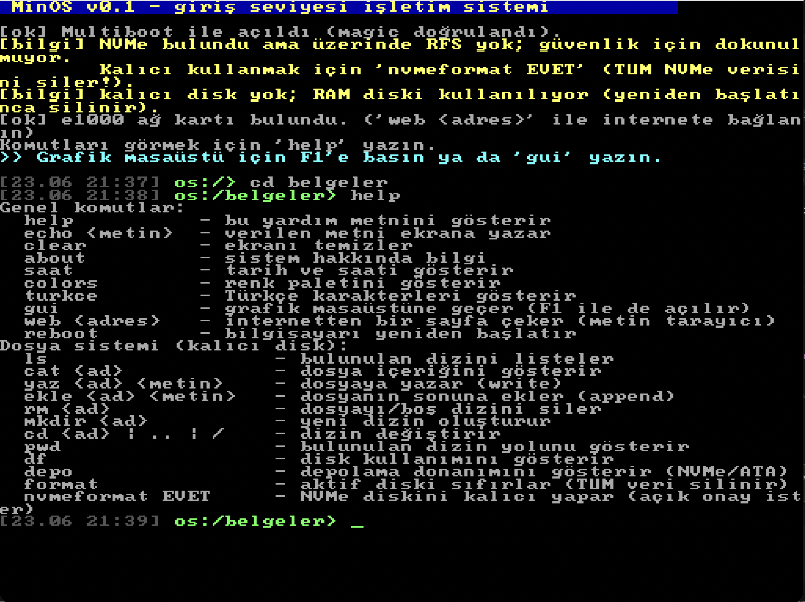
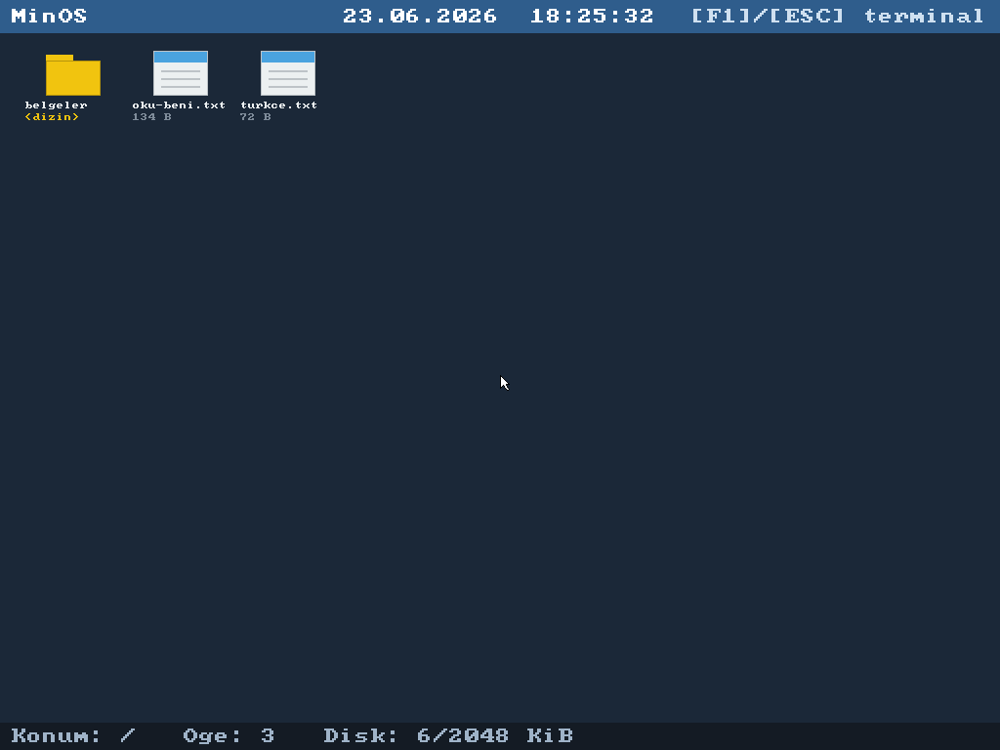
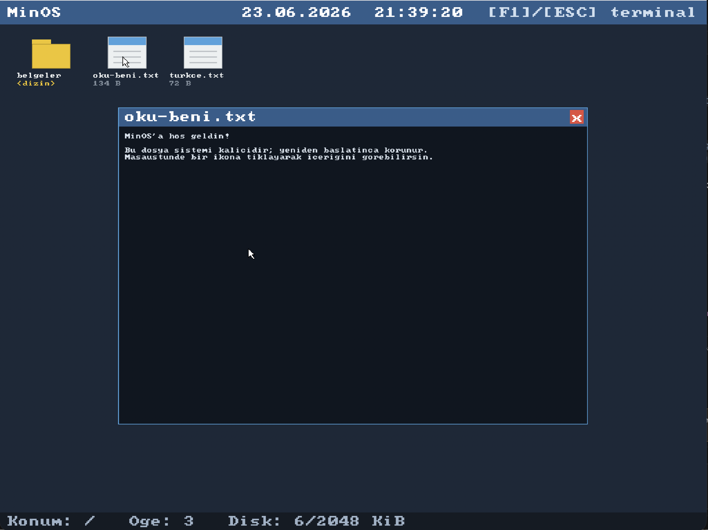
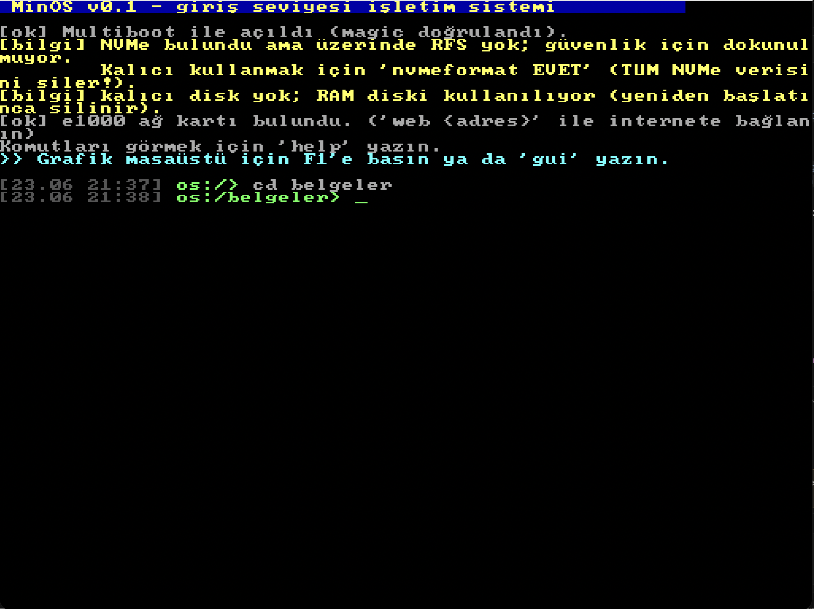

# MinOS — Giriş Seviyesi İşletim Sistemi

Rust + Assembly ile sıfırdan yazılmış, **Multiboot** uyumlu, 32-bit x86 için
küçük bir işletim sistemi çekirdeği. Açıldığında ekrana yazı basar, klavyeden
girdi okur ve basit bir **kabuk (shell)** sunar.



## Özellikler

- `no_std` Rust çekirdeği (standart kütüphane yok, işletim sistemi *biziz*)
- Assembly ile yazılmış Multiboot v1 başlığı ve giriş noktası (`src/boot.asm`)
- VGA metin modu sürücüsü: renkler, kaydırma (scroll), donanım imleci
- PS/2 klavye sürücüsü (kesmesiz, sürekli yoklama / *polling*) — **Türkçe-Q düzeni**
- Türkçe harf desteği: `ş ğ ı İ Ş Ğ` glifleri, VGA fontuna çalışma anında üretilip yüklenir
- **Dosya sistemi (RFS):** kendi basit formatımız + **dizin (klasör) desteği**;
  ATA/IDE, NVMe ve RAM diski arka uçları (ATA/NVMe kalıcı)
- **Grafik masaüstü (GUI):** framebuffer çizimi, fare imleci, dosya ve **klasör
  ikonları** — dosyaya tıklayınca içeriği pencerede açılır, klasöre tıklayınca
  içine girilir
- **PS/2 fare sürücüsü** ve klavye/fareyi tek noktadan yöneten birleşik giriş katmanı
- Gömülü 8x8 bitmap font ile grafik modda yazı çizimi (Türkçe harfler dahil)
- `F1` tuşuyla **terminal ↔ masaüstü** arasında geçiş
- **Masaüstü tarayıcı**: üst bardaki "Internet" düğmesiyle açılan, adres çubuğu (klavye) + tıklanabilir bağlantılar (fare) + kaydırma olan grafik web tarayıcısı (HTML→metin; `http` ve `https`)
- **Kod editörü + OS içinde C derleme**: üst bardaki **[+ Kod]** düğmesiyle açılan metin editöründe C yaz/kaydet, `run c4 <dosya.c>` ile **işletim sisteminin içinde** derleyip çalıştır (gömülü `c4` C derleyici+VM). C simgeleri için klavyede **AltGr** katmanı (`{ } [ ] \ | @ # ~`)
- Etkileşimli kabuk ve komutlar: `help`, `echo`, `clear`, `about`, `colors`, `turkce`, `gui`, `web`, dosya komutları, `reboot`
- Ağ ve internet: Intel e1000 sürücüsü + smoltcp TCP/IP yığını (DHCP, DNS, TCP, HTTP). `web <adres>` ile metin tabanlı sayfa çekme
- **HTTPS / TLS 1.3**: `rustls` (no_std) + RustCrypto sağlayıcı (`rustls-rustcrypto`) ile şifreli bağlantı; x25519 / P-256 anahtar değişimi, RSA + ECDSA imza, AES-GCM / ChaCha20-Poly1305. Sunucu sertifikası gömülü Mozilla kök sertifikalarıyla (`webpki-roots`) **doğrulanır**. `web https://...`
- Hiyerarşik dizinler: `mkdir`, `cd`, `pwd` ile alt klasörler (üst-işaretçi modeli; eski biçimle uyumlu)
- Hata ayıklama için COM1 seri port çıktısı

## Gereksinimler

macOS (Homebrew) için:

```bash
brew install rustup nasm qemu
rustup toolchain install nightly
rustup component add rust-src llvm-tools --toolchain nightly
```

Homebrew'in `rustup`'ı "keg-only" olduğundan PATH'in başına eklemeniz gerekir:

```bash
echo 'export PATH="/opt/homebrew/opt/rustup/bin:$PATH"' >> ~/.zshrc
source ~/.zshrc
```

> Projedeki `rust-toolchain.toml`, derlemede otomatik olarak nightly + `rust-src`
> kullanılmasını sağlar.

## Derleme ve Çalıştırma

**Tek komut yeter:**

```bash
make run          # TEK ortam: UEFI + grafik + NVMe diski. Her şey burada.
```

`make run` açıldığında her şeyi terminal komutlarıyla yaparsınız:

| Komut | Ne yapar |
|-------|----------|
| `help` | tüm komutları listeler |
| `gui` veya **F1** | grafik masaüstüne geçer |
| `saat` | tarih ve saati gösterir (gün adıyla) |
| `depo` | depolama donanımını gösterir (NVMe/ATA, blok boyutu) |
| `ls`, `cat`, `yaz`, `rm` | dosya işlemleri |
| `mkdir`, `cd`, `pwd` | dizin işlemleri (alt klasör desteği) |
| `web <adres>` | internetten bir sayfa çeker (metin tarayıcı; `http` ve `https`/TLS) |
| `nvmeformat EVET` | NVMe'yi kalıcı yapar (boş diskte güvenli) |

> **Dosyalar:** Varsayılan olarak dosyalar RAM'de tutulur (örnek dosyalar hazır
> gelir, ama yeniden başlatınca silinir). Kalıcı istiyorsanız bir kez
> `nvmeformat EVET` deyin; sonraki açılışlarda NVMe'den otomatik olarak kalıcı
> bağlanır.

Diğer (ileri/opsiyonel) hedefler:

```bash
make build        # sadece derler
make run-text     # hızlı metin modu (QEMU -kernel; F1 ile grafiğe geçilir)
make run-full     # tam ekran
make run-serial   # COM1 çıktısını terminale yansıtır
make iso-uefi     # gerçek donanım için USB'ye yazılabilir hibrit ISO
make clean        # derleme çıktılarını temizler
```

> **Pencere küçük mü?** `-display cocoa,zoom-to-fit=on` kullanılır; pencereyi
> köşesinden büyütünce içerik ölçeklenir, ya da `make run-full` ile tam ekran açın.

`make` kullanmadan doğrudan da çalıştırabilirsiniz:

```bash
cargo build
qemu-system-i386 -kernel target/i686-os/debug/rustos
```

QEMU penceresi açıldığında `help` yazıp Enter'a basın.

> **Not:** Ham `cargo` komutlarının çalışması için rustup'ın PATH'inizde olması
> ve nightly'yi seçmesi gerekir (yukarıdaki kurulum adımları bunu sağlar).
> En garantili yol `make` kullanmaktır; çünkü `Makefile`, rustup'ın nightly
> cargo'sunu tam yoluyla ve açıkça çağırır.

> QEMU penceresinden çıkmak için: menüden **Stop**, ya da `Ctrl` tuşuyla
> pencereyi kapatın. (Fareyi yakalarsa `Ctrl+Alt+G` ile bırakır.)

### Sanal makineye / gerçek donanıma kurmak (önyüklenebilir ISO)

`make run`, QEMU'ya özel `-kernel` kısayolunu kullanır; bu yüzden tek başına
VirtualBox/VMware gibi bir sanal makinede **çalışmaz.** Bağımsız çalışması için
GRUB içeren önyüklenebilir bir ISO üretmek gerekir. Bunun için gereken araçlar:

```bash
brew install i686-elf-grub xorriso mtools
```

Ardından:

```bash
make iso          # build/rustos.iso üretir (her yerde açılır)
make run-iso      # ISO'yu GRUB ile (—kernel OLMADAN) QEMU'da dener
```

Üretilen `build/rustos.iso` hibrit bir görüntüdür ve şuralarda açılır:

- **QEMU:** `qemu-system-i386 -cdrom build/rustos.iso`
- **VirtualBox / VMware:** Yeni bir VM oluşturup (tip: Other/Unknown, 32-bit)
  bu ISO'yu CD/DVD olarak takın ve başlatın.
- **Gerçek donanım / USB:** `dd if=build/rustos.iso of=/dev/diskX` ile bir USB'ye
  yazıp o makineyi USB'den açabilirsiniz. (Dosya sistemini kullanmak için
  bilgisayarda bir IDE/SATA disk gerekir.)

> Not: GRUB ISO'su yalnızca **Legacy BIOS / CSM** ile açılır. Modern UEFI-only
> makineler için aşağıdaki Limine hibrit ISO'yu kullanın.

### Modern donanım: UEFI + BIOS hibrit ISO (Limine)

Modern laptoplar genelde **UEFI-only**'dir; yukarıdaki GRUB ISO'su orada açılmaz.
Hem UEFI hem BIOS ile açılan bir hibrit ISO üretmek için **Limine** kullanıyoruz:

```bash
brew install limine xorriso mtools

make iso-uefi     # build/rustos-uefi.iso  (UEFI + BIOS, hibrit)
make run-uefi     # gerçek UEFI firmware (OVMF) ile QEMU'da dener
make run-bios-limine  # aynı ISO'yu Legacy BIOS ile QEMU'da dener
make run-nvme     # UEFI (OVMF) + emüle NVMe SSD ile dener (kalıcı NVMe testi)
```

`build/rustos-uefi.iso` şuralarda açılır:

- **Gerçek UEFI laptop / PC:** ISO'yu USB'ye yazın ve makineyi USB'den açın:
  ```bash
  diskutil list                      # USB'nin /dev/diskN adını bulun (DİKKAT!)
  diskutil unmountDisk /dev/diskN
  sudo dd if=build/rustos-uefi.iso of=/dev/rdiskN bs=4m
  ```
  Firmware'de **Secure Boot'u kapatın** (imzasız bootloader) ve gerekiyorsa
  USB'yi önyükleme sırasına alın. Açılışta grafik masaüstüne düşer.
- **VirtualBox / VMware:** ISO'yu CD/DVD olarak takın. (VirtualBox'ta
  Ayarlar → System → "Enable EFI" ile UEFI modunu da deneyebilirsiniz.)

### Kalıcı depolama: ATA/IDE, NVMe ve RAM diski

Sistem açılışta sırayla şu blok aygıtlarını dener:

1. **ATA/IDE** (QEMU `if=ide`, VirtualBox IDE) — varsa kalıcı.
2. **NVMe** (PCIe SSD; modern UEFI laptopların diski) — yalnızca üzerinde
   **zaten bizim dosya sistemimiz (RFS)** varsa otomatik kullanılır.
3. **RAM diski** — hiçbiri yoksa son çare. Masaüstü ve tüm dosya komutları
   çalışır, ama veriler **yeniden başlatınca silinir**.

> ⚠️ **GÜVENLİK — gerçek laptopunda dikkat:** NVMe diskin senin asıl işletim
> sistemini (Windows/macOS/Linux) barındırır. Bu yüzden sistem boş/yabancı bir
> NVMe diskini **asla otomatik biçimlendirmez** — biçimlendirmek o bölgedeki
> **tüm veriyi siler**. Kalıcı kullanmak istersen, bunu **bilerek** açık komutla
> yaparsın:
>
> ```
> nvmeformat EVET      # NVMe'nin ilk 2 MiB'ını RFS olarak biçimlendirir (YIKICI!)
> ```
>
> Bu yüzden günlük laptopunda kalıcı depolamayı **yalnızca boş/ayrılmış bir
> NVMe diskinde** kullan; ana SSD'ne dokunma. QEMU `make run-nvme` ve boş NVMe
> diskler için ise kalıcı depolama tam çalışır (test edilmiştir).

NVMe sürücüsü 32-bit çekirdek için yazıldığından, UEFI firmware'inin 64-bit MMIO
BAR'ı 4 GB üstüne koyması durumunda BAR'ı 4 GB altında bilinen bir adrese
(`0xFE000000`) yeniden programlar; aksi halde 32-bit çekirdek erişemezdi.

## Grafik Masaüstü (GUI)

Dosya sistemini bir masaüstünde gösteren basit bir grafik arayüz içerir.
Bir **framebuffer** (örn. 1024×768, 32-bit renk) üzerinde her şeyi (yazı, ikon,
fare imleci, pencere) piksel piksel kendimiz çizeriz.



- **Açmak için:** terminalde **`F1`**'e basın ya da `gui` yazın.
- **Dosya açmak:** bir dosya ikonuna **tıklayın**; içerik bir pencerede açılır.
  Pencereyi kırmızı **[X]** ile kapatın.
- **Dizinler:** klasörler sarı ikonla gösterilir. Bir klasöre tıklayınca içine
  girersiniz; sol üstteki gri **`..`** ikonuyla üst dizine çıkarsınız. Alt
  çubuk bulunulan dizin yolunu (`Konum: /belgeler` gibi) gösterir.
- **Geri dönmek:** `F1` veya `ESC` ile terminale dönersiniz.



> **İki framebuffer yolu vardır:**
> - **Önyükleyici ile (ISO / gerçek donanım — GRUB veya Limine, `make run`):**
>   önyükleyici framebuffer'ı kurar; taşınabilir yoldur.
> - **Metin modunda (`make run-text`, QEMU `-kernel`):** `F1`'e basınca çekirdek,
>   standart VGA aygıtının **Bochs‑VBE** yazmaçlarını programlayıp framebuffer'ı
>   **çalışma anında** kendisi açar (LFB adresini PCI'dan bulur). Geri dönüşte
>   terminal yine framebuffer üzerinde (grafik konsol) gösterilir; böylece
>   kırılgan VGA‑metin geri yüklemesine gerek kalmaz. QEMU ve VirtualBox'ın
>   Bochs‑VBE adaptöründe çalışır.
>
> Masaüstü, ilk biçimlendirmede oluşturulan örnek dosyalarla dolu gelir
> (`make clean-disk` sonrası yeniden üretilir).

## Proje Yapısı

| Dosya | Görevi |
|-------|--------|
| `src/boot.asm` | Multiboot başlığı, yığın ve `_start` giriş noktası |
| `src/main.rs` | `kernel_main` ve panik işleyici |
| `src/vga.rs` | VGA metin modu sürücüsü + `print!` yönlendirme |
| `src/gfx.rs` | Framebuffer (grafik) sürücüsü: piksel/dikdörtgen/çizgi |
| `src/fbcon.rs` | Grafik modda metin konsolu (8x8 fontla çizer) |
| `src/font_data.rs` | Gömülü 8x8 bitmap font + Türkçe glif üretimi |
| `src/gui.rs` | Masaüstü, ikonlar, fare imleci, dosya penceresi ve web tarayıcısı (adres çubuğu + tıklanabilir bağlantılar) |
| `src/mouse.rs` | PS/2 fare sürücüsü (yoklama) |
| `src/input.rs` | Birleşik giriş: 8042 baytlarını klavye/fareye yönlendirir |
| `src/keyboard.rs` | PS/2 klavye (Türkçe-Q) + scancode → karakter |
| `src/font.rs` | VGA metin fontuna Türkçe harfleri üretip yükler |
| `src/ata.rs` | ATA/IDE disk sürücüsü (PIO, sektör oku/yaz) |
| `src/nvme.rs` | NVMe (PCIe SSD) sürücüsü: admin/IO kuyrukları, sektör oku/yaz |
| `src/ramdisk.rs` | RAM tabanlı blok aygıtı (disk yoksa yedek; kalıcı değil) |
| `src/fs.rs` | RFS dosya sistemi (superblock, bitmap, dizin; ATA/NVMe/RAM arka ucu) |
| `src/shell.rs` | Komut satırı kabuğu |
| `src/serial.rs` | COM1 seri port (hata ayıklama) |
| `src/rtc.rs` | CMOS gerçek zaman saati (tarih/saat) okuyucu |
| `src/allocator.rs` | Yığın (heap) kurulumu — `alloc` için global ayırıcı |
| `src/mem.rs` | Sayfalama (identity 4 MiB), RAM tespiti (mmap), 4 KiB çerçeve ayırıcı |
| `src/idt.rs` / `src/isr.asm` | Kesme tablosu (IDT), CPU istisna işleyicileri (panik), sistem çağrısı (int 0x80), IRQ stub'ları |
| `src/pic.rs` | 8259A PIC yeniden eşlemesi + PIT zamanlayıcı (IRQ0, 100 Hz) — uptime/tick |
| `src/task.rs` | İşbirlikçi çekirdek görevleri + bağlam değiştirme (round-robin) |
| `src/gdt.rs` | GDT (ring0/ring3 segmentleri) + TSS (ring3→ring0 yığını) |
| `src/elf.rs` | ELF32 yükleyici (PT_LOAD segmentlerini kullanıcı sayfalarına eşler) |
| `src/user.rs` | ELF programını ring 3'te çalıştırma + bellek koruması sınaması |
| `src/fd.rs` | Kullanıcı süreçleri için dosya tanıtıcı (fd) tablosu — `open`/`read`/`write`/`close` |
| `src/userprog.asm` / `src/user.ld` | Ayrı derlenen örnek kullanıcı programı (build.rs + rust-lld) |
| `user/minos.h` / `user/crt0.c` / `user/hello.c` | C kullanıcı programı (clang ile derlenir, `cprog` ile çalışır) |
| `user/syscalls.c` | newlib porting katmanı (`_sbrk/_write/_read/...` → `int 0x80`) |
| `user/libminos.c` + `user/{stdio,stdlib,string,ctype}.h` | newlib-lite: printf/snprintf/malloc-calloc-realloc/qsort/strtol/string (alt küme) |
| `src/time.rs` | Monotonik ms saati (TSC, PIT ile kalibre; ağ zaman aşımları) |
| `src/e1000.rs` | Intel e1000 Ethernet sürücüsü (RX/TX DMA halkaları, yoklama) |
| `src/net.rs` | smoltcp TCP/IP yığını: DHCP + DNS + TCP + HTTP GET + HTTPS (rustls TLS 1.3 + RustCrypto + webpki-roots doğrulaması) |
| `src/port.rs` | `in`/`out` port G/Ç komutları (8/16/32-bit) |
| `src/pci.rs` | Küçük PCI tarayıcı: framebuffer, NVMe ve e1000'i bulur |
| `i686-os.json` | Özel bare-metal derleme hedefi |
| `linker.ld` | Bellek yerleşimi (1 MiB'den başlar) |
| `build.rs` | `boot.asm`'i NASM ile derler, linker betiğini bağlar |
| `grub.cfg` | GRUB menü girdisi (ISO için) |

## Açılış Akışı

```
GRUB / QEMU  ──►  boot.asm (_start)  ──►  kernel_main()  ──►  shell::run()
   (Multiboot)     yığını kurar          ekranı hazırlar     komutları işler
                   kernel_main'i çağırır
```

## Nasıl Çalışıyor? (kısa notlar)

- **Multiboot:** `boot.asm` içindeki sihirli sayı (`0x1BADB002`) sayesinde
  önyükleyici çekirdeği tanır ve 32-bit korumalı kipte (sayfalama kapalı) bize
  devreder. Çekirdek açılışta `src/mem.rs` ile sayfalamayı kendisi açar.
- **Sayfalama (paging):** `src/mem.rs` tüm 4 GiB adres alanını 4 MiB'lik büyük
  sayfalarla *birebir* (identity) eşler — sanal adres = fiziksel adres, dolayısıyla
  mevcut sürücüler değişmeden çalışır. MMIO bölgeleri (`>= 0xC000_0000`)
  önbelleksiz işaretlenir. Multiboot bellek haritasından (mmap) gerçek RAM bulunur;
  heap statik 4 MiB yerine RAM'in büyük bölümüne (~RAM kadar) genişler, üstte kalan
  dilim 4 KiB'lik çerçeve (frame) ayırıcıya ayrılır. `mem` komutuyla görüntülenir.
- **Kesmeler & kullanıcı modu:** `src/idt.rs`+`src/isr.asm` 32 CPU istisnasını
  yakalar (sayfa hatası dahil; `int 0x80` sistem çağrısı kapısı DPL=3). `src/gdt.rs`
  GDT + TSS ile ring 0/ring 3 segmentlerini kurar.
- **ELF + sistem çağrıları:** `src/userprog.asm` ayrı bir program olarak derlenip
  (build.rs, `nasm` + `rust-lld`) bir ELF ikilisi üretir; bu ELF çekirdeğe gömülür.
  `src/elf.rs` ELF başlığını/program başlıklarını ayrıştırıp `PT_LOAD` segmentlerini
  kullanıcı sayfalarına (US=1) eşler, `src/isr.asm`'deki `enter_user_mode` ile `iret`
  yaparak ring 3'e geçer. Program `int 0x80` ile Unix benzeri sistem çağrılarını
  kullanır (ebx/ecx/edx argüman, `eax` dönüş; -1 = hata): `write(fd, tampon, uzunluk)`,
  `read(fd, tampon, en fazla)`, `open(ad, uzunluk, bayrak)` → fd, `close(fd)`,
  `getpid()` → süreç kimliği, `exit(kod)`. fd 0 = klavye (stdin), fd 1 = konsol
  (stdout), fd ≥ 3 = RFS dosyası. Dosya açma/okuma/yazma `src/fd.rs`'deki küçük bir
  tanıtıcı tablosuyla yapılır; yazılanlar `close` anında kabuğun geçerli dizinindeki
  dosyaya işlenir. Sistem çağrısının sonucu kullanıcının `eax`'ine döner (stub `popa`
  ile geri yükler); `exit` çekirdek bağlamına temiz döner. ELF gömülü olabildiği
  gibi (`ring3`) diske de yazılıp (`kur`) diskten okunarak çalıştırılabilir
  (`run <dosya>`). Kullanıcı çekirdek
  belleğine yazmaya kalkarsa CPU sayfa hatası üretir ve çekirdek panik ekranı
  gösterir — kullanıcı programları çekirdeği bozamaz (`ring3` / `korumatest`).
- **Donanım kesmeleri (PIC + PIT):** `src/pic.rs` eski 8259A PIC çiftini yeniden
  eşler (IRQ'lar 0x20..0x2F vektörlerine; çünkü 0..31 CPU istisnalarına ayrılmış),
  PIT kanal 0'ı 100 Hz periyodik kesme kaynağı yapar. Her IRQ0 bir "tick" sayar
  (`uptime`/`süre` komutu). Bu, gerçek donanım kesmesi işleme ve ileride önleyici
  (preemptive) çok görevliliğin temelidir. (IRQ1/klavye altyapısı da var ama
  maskelidir: klavye 8042 tamponunu fare/GUI ile paylaştığından yoklama ile
  okunur — IRQ + yoklama birlikte aynı porttan okuyup çift girdiye yol açardı.)
- **Görev uyku (sleep):** `task::sleep_ticks` ile görevler belirli tik süresi uyur;
  `sleeptest`/`uyku` komutu 3 görevin farklı sürelerde uyanmasını gösterir.
  Sistem çağrısı `SYS_SLEEP` (eax=7, ebx=tik) ring 3 programlarına da açıktır.
- **Çok görevlilik (işbirlikçi + önleyici):** `src/task.rs` her biri kendi yığınına
  sahip çekirdek görevlerini round-robin çalıştırır. `context_switch` (isr.asm)
  callee-saved yazmaçları ve yığını değiştirerek bir görevden diğerine geçer.
  - *İşbirlikçi* (`gorevtest`): görevler `yield_now()` ile gönüllü sıra bırakır.
  - *Önleyici/preemptive* (`preempt`): görevler `yield` ÇAĞIRMAZ; zamanlayıcı
    kesmesi (IRQ0) `task::on_tick` üzerinden onları zorla böler. Demo, hiç işbirliği
    yapmayan 3 hesap-yoğun görevin CPU'yu neredeyse eşit paylaştığını sayaçlarla
    gösterir.
- **Ring 3 önleyici çok süreç:** `userpreempt` komutu iki ring 3 sürecini **ayrı
  sayfa tablolarında** (`mem::UserSpace`) çalıştırır; timer kesmesi ring 3'teyken
  süreçleri zorla değiştirir (aynı sanal adreste ayrı fiziksel sayaçlar). Ring 3
  artık IF=1 ile başlar (donanım kesmeleri açık).
- **C programı çalıştırma (`cprog`):** `user/` altındaki C kaynakları (`hello.c`,
  `crt0.c`, `minos.h`) **clang** ile (`--target=i386-unknown-none-elf -m32
  -ffreestanding`) derlenip **rust-lld** ile 32-bit ELF olarak linklenir
  (build.rs, i686-elf-gcc gerektirmez). Üretilen ELF çekirdeğe gömülür ve `cprog`
  ile ring 3'te çalışır. C tarafında libc yoktur; `minos.h` `int 0x80` sistem
  çağrılarını sağlar (`write/read/open/close/getpid/exit/sleep/sbrk`). Üzerine bir
  **newlib-lite** kütüphane (`user/libminos.c`) eklenmiştir:
  - `stdio.h`: `printf`/`snprintf`/`vsnprintf` (`%d %i %u %x %X %p %c %s %%`),
    `putchar`, `puts`, `getline_`
  - `stdlib.h`: `malloc`/`calloc`/`realloc`/`free` (**sbrk tabanlı** büyüyen heap),
    `atoi`, `strtol`, `abs`, `qsort`
  - `string.h`: `strlen/strcpy/strncpy/strcat/strncat/strcmp/strncmp/strchr/strrchr/
    memcpy/memmove/memset/memcmp`
  - `ctype.h`: `isdigit/isalpha/isalnum/isspace/tolower/toupper` ...

  Alt seviye G/Ç, **newlib porting katmanı** `user/syscalls.c` üzerinden yapılır
  (`_sbrk/_write/_read/_open/_close/_lseek/_fstat/_isatty/_exit/_getpid`). Bu, gerçek
  newlib eklendiğinde **aynen kalacak** kanonik katmandır.

  **Ağ kullanıcı alanına açık** (`SYS_FETCH`): bir ring 3 C programı `fetch(url, buf,
  cap)` çağrısıyla çekirdeğin HTTP/HTTPS (smoltcp + rustls) yığınını kullanıp bir web
  sayfasını çekebilir. `cprog` komutu, `http://example.com/`'u çeken minik bir
  "C tarayıcısı" örneğini ring 3'te çalıştırır ve doğrulanmıştır. (Syscall bir kesme
  kapısı olduğundan IF=0'dır; bu uzun bloklayan çağrı boyunca çekirdek kesmeleri
  geçici olarak açar ki PIT zamanlayıcısı ilerlesin ve ağ zaman aşımları çalışsın.)

  Bellek modeli (NetSurf gibi gerçek C uygulamalarına hazırlık): kullanıcı sanal
  bölgesi **64 MiB** (16 sayfa-tablosu penceresi), heap `sbrk` ile talep üzerine
  büyür — `malloc(1 MiB)` doğrulanmıştır. Yani artık **kendi yazdığın C kodu**
  (printf/malloc dahil) MinOS'ta derlenip ring 3'te çalışır (`cprog`).

  **Grafik kullanıcı alanına açık** (`SYS_GMODE`/`SYS_FILLRECT`/`SYS_BLIT`): bir ring 3
  C programı `gmode()` ile grafik moda geçer, `fill_rect(x,y,w,h,rgb)` ile dikdörtgen
  çizer ve kendi `malloc`'ladığı `0xRRGGBB` tamponunu tek `blit()` çağrısıyla ekrana
  basar. `boya` uygulaması (kaynak `user/paint.c`) bir gradyan + pano + zıplayan kare
  animasyonu çizerek bunu gösterir.

  **Çoklu C uygulaması, diskten çalıştırma:** her uygulama (`hello.c→web`, `calc.c`,
  `paint.c→boya`) ayrı bir ELF olarak linklenir (`--gc-sections` + `-s` ile küçültülür)
  ve çekirdeğe gömülür. `apps` komutu hepsini RFS'ye yazar; `run web` / `run calc` /
  `run boya` ile **diskten** yüklenip ring 3'te çalışır. (RFS dosya tavanı 22 KiB'a
  yükseltildi; blok no'ları girdide `u16` saklanır.) Örnek uygulamalar:
  - `calc` — etkileşimli tamsayı hesap makinesi (özyinelemeli ayrıştırıcı; `+ - * /`,
    parantez, işlem önceliği)
  - `boya` — framebuffer grafik demosu (gradyan + animasyon)
  - `web` — `http://example.com/`'u çeken minik C tarayıcısı
  - `c4` — **OS içinde çalışan küçük bir C derleyici+VM** (aşağıya bakın)

  > Not: dosya/uygulama adları MinOS'un Türkçe-Q klavyesinde kolay yazılsın diye `i`
  > harfi içermez (`i` tuşu noktasız `ı` üretir; noktalı `i` `'` tuşundadır).

  **OS içinde "yaz–derle–çalıştır" (kod editörü + c4):** Artık geliştirme döngüsünün
  tamamı MinOS'un içinde:
  1. Masaüstünde üst bardaki **[+ Kod]** düğmesiyle bir metin editörü açılır
     (`kod.c`, `kod2.c`, ...). Yaz, düzenle (`Enter`/`Backspace`), **[Kaydet]** ile
     RFS'ye yazılır. Var olan bir metin dosyasına tıklayınca da editörde açılır.
  2. Terminale dön (`F1`/`ESC`) ve `run c4 kod.c` ile **c4** kaynağı derler ve
     kendi sanal makinesinde çalıştırır — hepsi OS içinde, ana makinede derleme yok.

  `c4` ("C in four functions", Robert Swierczek, MIT) C'nin bir alt kümesini destekler:
  `char/int/pointer`, `if/while/return`, `enum`, `sizeof`, aritmetik/mantık/karşılaştırma
  işleçleri ve `open/read/close/printf/malloc/free/memset/memcmp/exit` kütüphane
  çağrıları. 32-bit hedefte `int == pointer == 4 bayt` olduğundan orijinal (long-long'suz)
  sürüm kullanılır; başlıklar ve `open` çağrısı MinOS mini-libc'sine uyarlandı
  (`user/c4.c`). Program argümanı (`run c4 <dosya>`) `SYS_GETARG` ile `crt0`'a iletilip
  `argv`'ye bölünür.

  **C için klavye — AltGr (Sağ Alt / macOS'ta Option) katmanı:** C'nin gerektirdiği
  `{ } [ ] \ | @ # ~` simgeleri Türkçe-Q'da AltGr ile üretilir (`AltGr+7={`, `AltGr+8=[`,
  `AltGr+9=]`, `AltGr+0=}`, `AltGr+* = \`, `AltGr+- = |`, `AltGr+Q=@`, `AltGr+3=#`,
  `AltGr+ü=~`). `<` / `>` iki şekilde yazılır: Z'nin solundaki 102. tuş (ISO klavye) **ya da**
  `AltGr+ö = <`, `AltGr+ç = >` (ANSI MacBook gibi 102. tuşu olmayan klavyeler için).

  **Editörde imleç:** Ok tuşları (←/→/↑/↓) ile gezinir, `Home`/`End` satır başı/sonu,
  `Delete` öndeki karakteri, `Backspace` imleçten önceki karakteri siler; yazılanlar
  imleç konumuna eklenir.

  Tam newlib **değildir**: dosya akışları (`FILE*`/`fopen`), kayan nokta biçimleri
  (`%f`), `<math.h>`, `setjmp/longjmp`, `iconv`/`locale` yoktur. Gerçek newlib için
  bir `i686-elf-gcc` + newlib cross-toolchain'i kurmak gerekir; `syscalls.c` o portun
  hazır temelidir.
- **VGA:** `0xB8000` adresindeki metin tamponuna her karakter 2 bayt (karakter +
  renk) olarak yazılır.
- **Klavye:** Kesme altyapısı kurmadan, `0x64` durum portu yoklanır ve `0x60`
  veri portundan tarama kodları okunur.
- **Framebuffer:** GRUB grafik modu verdiğinde, Multiboot bilgi yapısından
  tampon adresi/çözünürlük okunur ve piksellere doğrudan yazılır. Yazılar gömülü
  8x8 fontla, masaüstü ise basit dikdörtgenlerle çizilir.
- **Birleşik giriş:** Klavye ve fare aynı 8042 tamponunu paylaştığı için baytlar
  tek noktadan (`input::poll`) okunur ve "aux" bitine göre ayrıştırılır.
- **Yığın (heap):** Çekirdek statik bir bellek bölgesini global ayırıcıya verir
  (`src/allocator.rs`), böylece `alloc` etkindir ve ağ yığını gibi yerlerde
  `String`/`Vec` kullanılabilir. Çoğu çekirdek yolu yine de sabit tamponlarla
  çalışır.

## Dosya Sistemi (RFS)

Diske yazan basit bir dosya sistemi içerir. Hangi blok aygıtının kullanıldığına
göre kalıcılık değişir (yukarıdaki "Kalıcı depolama" bölümüne bakın): ATA/IDE
ya da biçimlenmiş NVMe **kalıcıdır** (`make run-text`'teki `disk.img` gibi),
RAM diski ise **kalıcı değildir** (`make run`'ın varsayılanı).



İlk açılışta disk boşsa otomatik biçimlendirilir. Komutlar:

| Komut | Açıklama |
|-------|----------|
| `ls` | Dosyaları ve boyutlarını listeler |
| `cat <ad>` | Dosya içeriğini gösterir |
| `yaz <ad> <metin>` | Dosyaya yazar (üzerine; `write` de olur) |
| `ekle <ad> <metin>` | Dosyanın sonuna ekler (`append`) |
| `rm <ad>` | Dosyayı veya boş dizini siler |
| `mkdir <ad>` | Yeni dizin (klasör) oluşturur |
| `cd <ad>` / `cd ..` / `cd /` | Dizine girer / üste çıkar / köke döner |
| `pwd` | Bulunulan dizin yolunu gösterir |
| `df` | Disk kullanımını gösterir |
| `format` | Diski sıfırlar (TÜM veri silinir) |

Örnek:

```
os:/> mkdir belgeler
dizin oluşturuldu
os:/> cd belgeler
os:/belgeler> yaz notlar merhaba dünya
tamam (14 bayt)
os:/belgeler> ls
notlar  (14 bayt)
os:/belgeler> cat notlar
merhaba dünya
os:/belgeler> cd ..
os:/>
```

### Disk düzeni

| Blok | İçerik |
|------|--------|
| 0 | Superblock (sihirli sayı, sürüm, toplam blok) |
| 1 | Blok ayırma haritası (bitmap), 1 bit = 1 blok |
| 2–9 | Girdi tablosu: 8 blok × 4 girdi = 32 girdi (dosya + dizin) |
| 10+ | Veri blokları |

Her dosya en çok 22 doğrudan bloğa (≈ 11 KiB) sahip olabilir. **Dizinler
desteklenir:** her girdi `kind` (dosya/dizin) ve `parent` (üst dizin) bilgisini
tutar — "üst-işaretçi" modeli. Bu alanlar girdideki kullanılmayan dolgu
baytlarına yerleştirildiğinden eski biçimlenmiş diskler de uyumludur (eski
dosyalar otomatik kök dizinde görünür). Disk imajı varsayılan 2 MiB'tır
(`make disk`).

> Kalıcı verileri sıfırlamak için: `make clean-disk` (disk imajını siler).

## Sık Karşılaşılan Sorun

```
error: `.json` target specs require -Zjson-target-spec to be added to the cargo invocation
```

Bu hata, derlemenin **nightly yerine Homebrew'in stable cargo'su** ile yapıldığı
anlamına gelir (özel `.json` hedefi nightly gerektirir). Çözüm: `make` kullanın
(önerilir) veya rustup'ı PATH'inizin başına ekleyip nightly'yi kullanın:

```bash
export PATH="/opt/homebrew/opt/rustup/bin:$PATH"
cargo +nightly build
```

## Sonraki Adımlar (öğrenmeye devam)

- Görevler arası iletişim (mutex/kanal), öncelikli zamanlama
- Ring 3 süreçler için tam `fork`/`exec` ve `wait` modeli
- Gerçek C tarayıcı/port için daha zengin libc ve sürücü altyapısı
- Çok görevlilik (çok basit bir zamanlayıcı)
- GUI'de dosya oluşturma/silme ve çok parçalı yol (`cd a/b/c`)

> Tamamlananlar: yığın (heap) ayırıcı, dizin (klasör) desteği — `mkdir`/`cd`/`pwd`
> ve GUI'de klasör gezintisi, ağ/internet (e1000 + smoltcp ile `web`),
> HTTPS/TLS 1.3 (rustls + RustCrypto, sertifika doğrulamalı; `web https://...`),
> **sayfalama (paging)** — birebir (identity) 4 MiB eşleme, MMIO önbelleksiz;
> Multiboot bellek haritasından RAM tespiti ile büyük heap (~RAM kadar) ve
> 4 KiB çerçeve (frame) ayırıcı (`mem` komutuyla görüntülenir),
> **kesme tablosu (IDT)** — 32 CPU istisnasını yakalar; hata olunca üçlü hata/reset
> yerine panik ekranı (#PF'de CR2 ile hatalı adres) gösterir (`inttest` ile sınanır),
> **kullanıcı modu (ring 3)** — GDT + TSS, ring 0/ring 3 segmentleri, kullanıcıya
> ait 4 KiB sayfalar (US biti), `int 0x80` sistem çağrısı (`write`/`exit`),
> **ELF32 yükleyici** — ayrı derlenen gerçek bir program ikilisini (`userprog.asm`)
> kullanıcı adres alanına yükleyip ring 3'te çalıştırır; `ring3` gömülü ELF'i
> çalıştırır, `kur` onu diske (RFS) yazar ve `run <dosya>` **diskteki bir ELF'i**
> okuyup çalıştırır (program kendi belleğindeki metni sistem çağrısıyla yazdırıp
> `exit` eder), `korumatest` ise kullanıcı modundan çekirdek belleğine yazmayı
> deneyip **bellek korumasını** (sayfa hatası) gösterir.

## Lisans

[MIT](LICENSE) — özgürce kullanabilir, değiştirebilir ve dağıtabilirsiniz.
